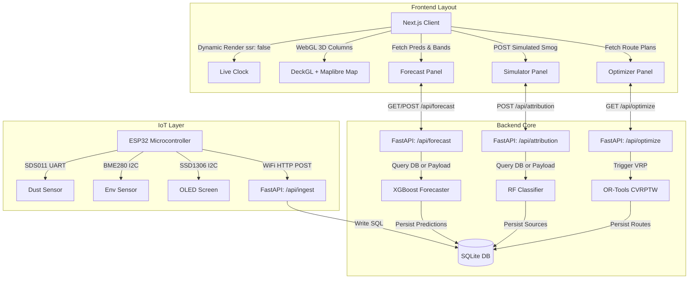

# PROGRESS.md

## 1. Project Overview

### Purpose
**VayuBudhi** is an intelligent, closed-loop environmental commander system designed for the National Capital Region (NCR) of Delhi. It coordinates real-time telemetry from physical IoT hardware monitors, applies machine learning predictive models to forecast air quality and attribute pollution sources, and solves vehicle routing optimization problems to coordinate municipal response teams.

### Overall Architecture
The system consists of five decoupled layers:
1. **IoT Firmware Layer**: An ESP32 DevKit V1 microcontroller equipped with SDS011 and BME280 sensors, running a non-blocking execution loop. It displays local metrics on an OLED screen, buffers data during connection drops, and streams JSON telemetry packets over WiFi.
2. **Backend (FastAPI)**: Serves as the central integration bus. It exposes CORS-enabled REST endpoints, validates schemas via Pydantic, manages database persistence using SQLAlchemy, orchestrates ML inference, and computes optimal dispatch paths.
3. **Database (SQLite)**: A persistent SQLite database (`vayubudhi.db`) managed via SQLAlchemy, logging raw sensor telemetry, computed ML forecasts, source attributions, and optimization route logs.
4. **Machine Learning Pipeline (XGBoost / Random Forest)**: Standardized Python models running in-process via serialized checkpoints (`.pkl`). The forecasting model utilizes XGBoost coupled with MAPIE conformal prediction intervals. The attribution classifier utilizes a Random Forest model.
5. **Frontend Dashboard (Next.js)**: A client-side visual dashboard featuring high-fidelity WebGL mapping via `deck.gl` on top of a `Maplibre GL` canvas. It maps AQI columns in 3D, hosts an interactive smog simulator, renders forecast curves using `recharts`, and overlays vehicle routing schedules.

```
       +-----------------------------------------------------------+
       |                  Next.js Frontend (UI)                    |
       +-----------------------------------------------------------+
          ^                       ^                       ^
          | GET/POST /forecast    | GET/POST /attribution | GET /optimize
          v                       v                       v
       +-----------------------------------------------------------+
       |                  FastAPI Backend Server                   |
       +-----------------------------------------------------------+
          |                       |                       |
          | Read/Write            | Inference             | Route Nodes
          v                       v                       v
    +-----------+          +---------------+       +---------------+
    | SQLite DB |          |  ML Services  |       | OR-Tools VRP  |
    +-----------+          +---------------+       +---------------+
          ^
          | POST /api/ingest
          |
    +---------------------------+
    |  ESP32 IoT Weather Node   |
    +---------------------------+
```

---

## 2. Current Architecture



---

## 3. Frontend Progress

### Technology Stack
* **Core**: Next.js 13.5 (React 18), TypeScript.
* **Styling**: Vanilla CSS with dark mode tokens (`index.css` / `globals.css`).
* **Visual Map**: `deck.gl` for high-performance WebGL overlays, `react-map-gl/maplibre` and `maplibre-gl` for map rendering.
* **Charts**: `recharts` for dynamic SVG curves.

### Component & Folder Organization
```
frontend/
├── src/
│   ├── app/
│   │   ├── globals.css             # Theme configuration & global overrides
│   │   ├── layout.tsx              # Root HTML layout structure
│   │   └── page.tsx                # Dashboard page wrapper (dynamic panels)
│   ├── components/
│   │   ├── DelhiMap.tsx            # WebGL 3D Column Map (deck.gl)
│   │   ├── ForecastPanel.tsx       # Live Forecast Charts & Connection Banner
│   │   ├── OptimizerPanel.tsx      # Dispatch routes, ETAs, & ROI Metrics
│   │   ├── SimulatorPanel.tsx      # Smog scenario selection & status triggers
│   │   └── AdvisoryPanel.tsx       # Public warnings & health guidelines
│   ├── data/
│   │   ├── mockStations.ts         # Base monitoring station lists (Delhi GPS)
│   │   ├── mockForecast.ts         # Default 72-hour forecast dataset
│   │   ├── mockRoutes.ts           # Secondary backup route vectors
│   │   └── mockHexGrid.ts          # Static 3D Hexagonal mapping coordinates
│   └── types/
│       ├── contracts.ts            # Pydantic-to-TypeScript interfaces
│       └── deck.gl.d.ts            # Type definitions for Deck.gl layers
```

### Component Details

#### A. Map Implementation (`DelhiMap.tsx`)
* Loads map assets purely on the client side (`ssr: false`) to avoid server canvas compilation issues.
* Renders a `DeckGL` canvas displaying three-dimensional columns:
  * Hexagonal grid items are loaded from `hexGridData`. Height is exponentially scaled to visual AQI, and color is interpolated (green $\rightarrow$ yellow $\rightarrow$ orange $\rightarrow$ red $\rightarrow$ purple).
  * Renders `ScatterplotLayer` objects representing air quality stations. If a station belongs to `source: "iot"`, it is styled with a glowing teal outer ring.
  * Captures mouse over coordinates to update hover states (`hoveredHex` or `hoveredStation`).

#### B. Simulation Flow (`SimulatorPanel.tsx`)
* Exposes simulated hotspot conditions: *Morning Traffic Rush*, *Dry Dust Storm*, and *Winter Trash Burning*.
* On trigger:
  1. Compiles coordinates and current readings from the mock IoT station.
  2. Sends a `POST` request to `http://127.0.0.1:8000/api/attribution` with simulated PM and meteorological parameters.
  3. Begins a 42-second status animation (0-8s: *Detecting Hotspot*, 8-18s: *Attributing Cause*, 18-32s: *Computing Optimal Routes*, 32-42s: *Units Dispatched*).
  4. Returns the predicted source set and displays it dynamically.

#### C. Forecast Module (`ForecastPanel.tsx`)
* Renders a 72-hour forecast chart. It calls the backend using:
  * `POST /api/forecast` to dynamically scale the local 72-hour trend curve to align with the backend's real 24-hour XGBoost prediction point.
  * `GET /api/forecast` and `GET /api/attribution` on mount to show the status of the connection.
* Displays a **"Live API & ML Model Connected"** banner when the backend is active, showcasing real point values and map bounds.

#### D. Optimizer Module (`OptimizerPanel.tsx`)
* Fetches paths solved by OR-Tools from `GET /api/optimize`.
* Combines live route schedules (if connected) with pre-modeled backup schedules, demonstrating ETAs, compliance codes, ROIs, and expected AQI reductions.

#### E. Advisory Module (`AdvisoryPanel.tsx`)
* Maps the current average AQI to public safety suggestions, displaying municipal alerts, health suggestions, and GRAP stage advisories.

### State & Mocks
* **State**: Managed via standard React hooks (`useState`, `useMemo`, `useCallback`). 
* **Mock Data**: Holds fallback arrays for Delhi locations (Anand Vihar, Punjabi Bagh, Mandir Marg) and static hex coordinates (`mockHexGrid.ts`) to ensure the map renders if the backend is offline.

### Summary of Progress
* ✅ **Completed**: 3D deck.gl WebGL column layers, dynamic sidebar navigation, interactive simulator triggers, live-API connection banners, and responsive chart components.
* ⬜ **Remaining**: Real-time GPS coordinate mapping of dispatched vehicles, socket streaming for immediate sensor ingestion indicators, and an admin configuration panel.

---

## 4. Backend Progress

### Technical Stack
* **Framework**: FastAPI (Asynchronous Python ASGI).
* **Database engine**: SQLite, SQLAlchemy ORM (thread-safe, synchronous local connections).
* **Validation**: Pydantic v2 schemas.
* **Server**: Uvicorn.

### Folder Structure
```
backend/
├── app/
│   ├── main.py                     # Entry point (CORS, router initialization)
│   ├── database.py                 # SQLite configuration and DB Session management
│   ├── models.py                   # SQLAlchemy ORM database models
│   ├── schemas.py                  # Pydantic validation schemas (API contracts)
│   ├── ml_service.py               # Singleton interface to ML XGBoost/RF models
│   ├── test_endpoints.py           # API endpoint integration test suite
│   ├── test_live_integration.py    # End-to-end integration demo script
│   ├── optimization/
│   │   ├── __init__.py
│   │   ├── roi.py                  # Economic ROI and compliance benefit calculators
│   │   ├── solver.py               # Vehicle Routing Problem (VRP) solver via OR-Tools
│   │   └── router.py               # Node adapters converting SQL logs to solver inputs
│   └── routers/
│       ├── __init__.py
│       ├── health.py               # Health verification endpoints
│       ├── ingest.py               # IoT data receiver
│       ├── forecast.py             # Forecast prediction routes
│       ├── attribution.py          # Source attribution routes
│       └── optimize.py             # Route solver endpoints
└── requirements.txt                # Python backend dependencies
```

### Database Schema & Relationship Flow

```
+------------------------------------+
|          sensor_readings           |
+------------------------------------+
| id (INTEGER, PK)                   |
| station_id (VARCHAR)               |
| timestamp (DATETIME)               |
| pm25 (FLOAT)                       |
| pm10 (FLOAT)                       |
| temp (FLOAT)                       |
| humidity (FLOAT)                   |
| pressure (FLOAT)                   |
| wind_speed (FLOAT)                 |
| pblh (FLOAT)                       |
| created_at (DATETIME)              |
+------------------------------------+
                  |
                  | Logged inputs trigger predictions
                  v
+------------------------------------+          +------------------------------------+
|             forecasts              |          |        attribution_results         |
+------------------------------------+          +------------------------------------+
| id (INTEGER, PK)                   |          | id (INTEGER, PK)                   |
| station_id (VARCHAR)               |          | station_id (VARCHAR)               |
| timestamp (DATETIME)               |          | timestamp (DATETIME)               |
| horizon_h (INTEGER)                |          | prediction_set (JSON list)         |
| point (FLOAT)                      |          | set_size (INTEGER)                 |
| lower (FLOAT)                      |          | confidence (FLOAT)                 |
| upper (FLOAT)                      |          | created_at (DATETIME)              |
| ventilation_index (FLOAT)          |          +------------------------------------+
| created_at (DATETIME)              |
+------------------------------------+
                  |
                  | Predicted hotspots feed routing targets
                  v
+------------------------------------+          +------------------------------------+
|         enforcement_routes         |          |            roi_results             |
+------------------------------------+          +------------------------------------+
| id (INTEGER, PK)                   |          | id (INTEGER, PK)                   |
| route_id (VARCHAR)                 |          | route_id (VARCHAR)                 |
| vehicle_type (VARCHAR)             |          | roi (FLOAT)                        |
| stops (JSON list)                  |          | benefit_score (FLOAT)              |
| created_at (DATETIME)              |          | cost_score (FLOAT)                 |
+------------------------------------+          | created_at (DATETIME)              |
                                                +------------------------------------+
```

---

### Endpoint Reference & Execution Flows

#### 1. Ingest Telemetry
* **Endpoint**: `POST /api/ingest`
* **Purpose**: Telemetry ingestion route for the ESP32 weather station.
* **Request Format (JSON)**:
  ```json
  {
    "station_id": "esp32_01",
    "timestamp": "2026-07-07T10:15:00Z",
    "pm25": 142.3,
    "pm10": 168.9,
    "temp": 31.2,
    "humidity": 58.4,
    "pressure": 1008.1,
    "wind_speed": 3.0,   // Optional (Default: 3.0)
    "pblh": 1000.0        // Optional (Default: 1000.0)
  }
  ```
* **Validation**: Handled by `schemas.SensorReading`. Requires float values. Wind speed and PBLH are optional and default to typical ambient levels (3.0 and 1000.0) if omitted (crucial for physical sensors that lack wind or PBLH measurements).
* **Processing Flow**:
  1. FastAPI parses the incoming JSON into the `SensorReading` pydantic model.
  2. Opens a session with SQLite.
  3. Maps schema parameters to a new `models.SensorReading` row.
  4. Writes data to the `sensor_readings` table.
* **Frontend Consumer**: None directly; telemetry is supplied by the physical ESP32 or simulation panel.
* **Status**: Fully Implemented.

#### 2. Get/Post Forecast
* **Endpoint**: `POST /api/forecast` & `GET /api/forecast`
* **Purpose**: Generates and returns a 24h AQI forecast.
* **Request Format (POST JSON)**: A `SensorReading` payload.
* **Request Format (GET query)**: Standard HTTP GET (uses the latest database record from the SQLite logs).
* **Response Format**:
  ```json
  {
    "horizon_h": 24,
    "point": 96.94026184082031,
    "interval": [0.0, 201.50909423828125],
    "ventilation_index": 3000.0
  }
  ```
* **Processing Flow**:
  1. Extracts coordinates and sensor variables.
  2. Feeds parameters into the `MLService` XGBoost forecaster.
  3. Computes the predicted AQI point value, MAPIE conformal range boundaries, and ventilation index.
  4. Writes output record to the `forecasts` table.
* **Frontend Consumer**: `ForecastPanel.tsx` (chart anchor point calibration and live status header).
* **Status**: Fully Implemented.

#### 3. Get/Post Source Attribution
* **Endpoint**: `POST /api/attribution` & `GET /api/attribution`
* **Purpose**: Identifies the primary air pollution source.
* **Request Format (POST JSON)**: A `SensorReading` payload.
* **Request Format (GET query)**: Standard HTTP GET (uses the latest database record).
* **Response Format**:
  ```json
  {
    "prediction_set": ["industrial"],
    "set_size": 1,
    "confidence": 0.9,
    "probabilities": {
      "industrial": 0.8873039215686275,
      "vehicular": 0.11269607843137255
    }
  }
  ```
* **Processing Flow**:
  1. Passes parameters to the `MLService` Random Forest Classifier.
  2. Predicts emission categories and returns class probabilities.
  3. Writes attribution parameters to the `attribution_results` database table.
* **Frontend Consumer**: `SimulatorPanel.tsx` (classification targets) and `ForecastPanel.tsx`.
* **Status**: Fully Implemented.

#### 4. Route Optimization
* **Endpoint**: `GET /api/optimize`
* **Purpose**: Solves the dispatch allocation routes for municipal response units.
* **Response Format**:
  ```json
  {
    "route_id": "inspector_1",
    "stops": [
      {
        "source_id": "S01",
        "lat": 28.6469,
        "lon": 77.3164,
        "eta": "09:23",
        "action": "FULL_INSPECTION",
        "roi": 210.2
      }
    ]
  }
  ```
* **Processing Flow**:
  1. Queries hotspot points (SQL tables).
  2. Converts coordinates into vehicle matrix nodes via `router.py`.
  3. Solves the routing matrix using Google OR-Tools (`solver.py`) for inspector, van, and drone categories.
  4. Logs vehicle paths to `enforcement_routes` and calculated returns to `roi_results`.
* **Frontend Consumer**: `OptimizerPanel.tsx`.
* **Status**: Fully Implemented.

---

## 5. ML Model Progress

### Folder Structure
```
ml_model/
├── data/
│   ├── forecaster.pkl              # Serialized XGBoost model (with MAPIE wrappers)
│   ├── classifier.pkl              # Serialized Random Forest classifier
│   ├── openaq_sample.csv           # Atmospheric background datasets
│   └── openmeteo_sample.csv        # Meteorological datasets
└── src/
    ├── train.py                    # Training pipelines for XGBoost & Random Forest
    ├── preprocess_and_label.py     # Source tagging and data cleaning pipelines
    ├── uncertainty.py              # MAPIE conformal interval generators
    ├── inference.py                # Wrapper interfaces for backend calls
    └── test_inference.py           # Unit tests for local model validation
```

### Current Models

#### A. Forecast Model (XGBoost + MAPIE)
* **Algorithm**: XGBoost Regressor.
* **Features Used**: PM2.5, PM10, Temp, Humidity, Pressure, Wind Speed, PBLH.
* **Uncertainty Calibration**: MAPIE (Model Agnostic Prediction Interval Estimator). It computes a 90% confidence conformal coverage range to output lower and upper prediction limits.
* **Backend Integration**: Exposes `get_forecast_inference(features_dict)`.

#### B. Source Attribution Model (Random Forest)
* **Algorithm**: Random Forest Classifier.
* **Target Classes**: `industrial`, `vehicular`, `biomass`, `dust`.
* **Backend Integration**: Exposes `get_attribution_inference(features_dict)`.

### Summary of Progress
* ✅ **Completed**: XGBoost regression training, Random Forest classifier construction, MAPIE uncertainty mapping, model serialization (`.pkl`), and `MLService` FastAPI integration.
* ⬜ **Remaining**: Live retraining pipeline execution on database thresholds, meteorological API hooks for real-time wind speed updates.

---

## 6. IoT Firmware Progress (Detailed Hardware Guide)

### Module Directory Structure
```
iot_firmware/
├── platformio.ini                  # Compiler dependencies, library declarations, and target flags
└── src/
    ├── config.h                    # WiFi configurations, API routes, and test flags
    ├── wifi_manager.h/.cpp         # Auto-reconnection WiFi state machine
    ├── sensor_manager.h/.cpp       # SDS011 UART parser and BME280 driver
    ├── display_manager.h/.cpp      # SSD1306 OLED screen rendering and alerts
    ├── api_client.h/.cpp           # API transmission queue and cached buffer
    └── main.cpp                    # Primary execution orchestrator
```

---

### File-by-File Breakdown

```
                         +-----------------------------------+
                         |             main.cpp              |
                         |  (Orchestrator loop every 5s)      |
                         +-----------------------------------+
                                           |
                  +------------------------+------------------------+
                  |                        |                        |
                  v                        v                        v
    +---------------------------+  +---------------------------+  +---------------------------+
    |     sensor_manager        |  |      display_manager      |  |        wifi_manager       |
    |  - Reads BME280 via I2C   |  |  - Renders metrics on OLED|  |  - Manages connections    |
    |  - Parses SDS011 via UART |  |  - Displays WiFi status   |  |  - Handles auto-reconnect |
    +---------------------------+  +---------------------------+  +---------------------------+
                  |                                                             |
                  | Telemetry Data                                              | Connection Status
                  +------------------------+------------------------------------+
                                           |
                                           v
                             +---------------------------+
                             |        api_client         |
                             |  - Generates JSON payload |
                             |  - Manages Ring Buffer    |
                             |  - Sends POST requests    |
                             +---------------------------+
```

#### 1. Configuration: `config.h`
* **Purpose**: Defines operational limits, pinouts, and network configurations.
* **Responsibilities**:
  * Manages WiFi credentials (`WIFI_SSID`, `WIFI_PASS`).
  * Stores API target paths (`BACKEND_API_URL` set to `http://127.0.0.1:8000/api/ingest`).
  * Establishes hardware registers:
    * SDS011 UART Interface: RX Pin (16), TX Pin (17).
    * I2C Interface: SDA (21), SCL (22).
  * Toggle Switch: `#define MOCK_MODE true` (allows testing without connected sensors).

#### 2. Main Coordinator: `main.cpp`
* **Purpose**: Main program entry point and execution loop.
* **Responsibilities**:
  * Runs system boot check (`setup()`) to start serial logs, mount OLED displays, verify sensor addresses, and trigger WiFi.
  * Controls the non-blocking execution loop (`loop()`). It executes:
    * `WiFiManager::keepAlive()` on every pass.
    * A reading scan, OLED refresh, and backend transmission routine exactly once every **5 seconds** using a millisecond timer (`millis()`).
  * **Dependencies**: `config.h`, `wifi_manager.h`, `sensor_manager.h`, `display_manager.h`, `api_client.h`.

#### 3. Network Handler: `wifi_manager.cpp`
* **Purpose**: Standardizes network connection and auto-recovery.
* **Important Functions**:
  * `WiFiManager::begin()`: Initializes WiFi in Station mode (`WIFI_STA`) and starts the connection attempt.
  * `WiFiManager::keepAlive()`: A non-blocking connection monitor. If WiFi drops, it triggers a reconnection attempt in the background without halting the sensor reading and display loops.
  * `WiFiManager::isConnected()`: Returns boolean connection status.
* **Dependencies**: `WiFi.h`, `config.h`.

#### 4. Sensor Interface: `sensor_manager.cpp`
* **Purpose**: Manages communication with physical sensors.
* **Responsibilities**:
  * **BME280 (I2C)**: Reads ambient temperature, relative humidity, and pressure using the Adafruit BME280 library.
  * **SDS011 (UART)**: Reads particulate matter data over a secondary hardware serial port (`Serial2` at 9600 baud). It parses incoming data packets byte-by-byte using the standard SDS011 frame format:
    * Frame header: `0xAA`
    * Command ID: `0xC0`
    * Data bytes: 2 bytes for PM2.5, 2 bytes for PM10
    * Checksum verification
    * Tail byte: `0xAB`
* **Important Functions**:
  * `SensorManager::begin()`: Initializes I2C addresses and Serial2 registers.
  * `SensorManager::read()`: Non-blocking function that reads the BME280 sensor and parses the SDS011 UART buffer. Returns a populated `SensorData` struct.
  * `SensorManager::readMock()`: Used when `MOCK_MODE` is enabled. It uses random offsets from typical baseline values to generate mock readings:
    * PM2.5 $\approx 140\ \mu\text{g/m}^3$ (Delhi winter baseline)
    * PM10 $\approx 160\ \mu\text{g/m}^3$
    * Temperature $\approx 31.0^\circ\text{C}$
    * Humidity $\approx 55.0\%$
    * Pressure $\approx 1008.0\text{ hPa}$
* **Dependencies**: `Adafruit_Sensor.h`, `Adafruit_BME280.h`, `config.h`.

#### 5. Screen Driver: `display_manager.cpp`
* **Purpose**: Renders real-time telemetry on the OLED screen.
* **Responsibilities**:
  * Displays current sensor readings (PM2.5, PM10, Temperature, Humidity).
  * Shows network status icons (WiFi connection state).
  * Triggers a visual alert warning (flashing screen borders and a `HIGH PM2.5 WARNING` message) if PM2.5 levels exceed $150\ \mu\text{g/m}^3$.
* **Important Functions**:
  * `DisplayManager::begin()`: Initializes the SSD1306 controller over I2C (`0x3C`).
  * `DisplayManager::update(data, connected)`: Refreshes the display layout with current metrics and connection status.
* **Dependencies**: `Adafruit_GFX.h`, `Adafruit_SSD1306.h`, `config.h`.

#### 6. API Client & Queue: `api_client.cpp`
* **Purpose**: Manages data transmission and local offline caching.
* **Responsibilities**:
  * Generates JSON payloads matching the backend Pydantic schema using the `ArduinoJson` library.
  * Transmits telemetry to the backend server via HTTP POST.
  * **Offline Mode (Caching & Queue)**:
    * Uses a local ring buffer to cache telemetry during network drops.
    * The buffer holds up to **120 readings** (representing 10 minutes of logs at 5s polling intervals).
    * When network connection is restored, it flushes the cached readings chronologically (FIFO order) to ensure no data is lost.
* **Important Functions**:
  * `ApiClient::send(data)`: Sends telemetry to the backend. If the connection fails, it pushes the reading to the queue:
    * `struct QueueItem { SensorData data; uint32_t secondsAgo; }`
    * The `secondsAgo` parameter tracks when the reading was taken relative to the transmission time, allowing the backend to calculate the correct measurement timestamp.
  * `ApiClient::processQueue()`: Triggered once network connection is restored. It pops items from the queue and sends them to the backend with their relative age offsets.
* **Dependencies**: `HTTPClient.h`, `ArduinoJson.h`, `config.h`.

---

### Hardware Developer Notes

#### 1. Data Schema
The ESP32 sends a JSON payload to the backend. The following table describes the fields in the payload:

| Field Name | Data Type | Required | Description |
| :--- | :--- | :--- | :--- |
| `station_id` | String | Yes | Unique identifier for the station (e.g., `esp32_01`). |
| `timestamp` | ISO 8601 String | Yes | Measurement timestamp (e.g., `2026-07-07T10:15:00Z`). |
| `pm25` | Float | Yes | PM2.5 particulate concentration ($\mu\text{g/m}^3$). |
| `pm10` | Float | Yes | PM10 particulate concentration ($\mu\text{g/m}^3$). |
| `temp` | Float | Yes | Temperature ($^\circ\text{C}$). |
| `humidity` | Float | Yes | Relative humidity percentage ($0.0 - 100.0$). |
| `pressure` | Float | Yes | Atmospheric pressure (hPa). |
| `wind_speed` | Float | No | Defaults to `3.0` if omitted. |
| `pblh` | Float | No | Defaults to `1000.0` if omitted. |

#### 2. Code Execution Flow: `MOCK_MODE true` vs `MOCK_MODE false`

```
  MOCK_MODE true                                   MOCK_MODE false
==================                               ===================
1. setup() runs:                                 1. setup() runs:
   - Serial monitor initialized                     - Serial monitor initialized
   - Bypasses I2C/SPI sensor checks                 - Scans I2C bus for SSD1306 OLED (0x3C)
   - Bypasses SSD1306 OLED setup                    - Scans I2C bus for BME280 Env Sensor (0x76)
                                                    - Initializes UART Serial2 for SDS011 (9600)
2. loop() runs:                                  
   - wifi_manager starts connecting                 2. loop() runs:
                                                    - wifi_manager starts connecting
3. Timer fires (5s):                                
   - Generates mock measurements:                   3. Timer fires (5s):
     PM2.5 = 140 + rand                               - Reads BME280 (Temp, Hum, Pres)
     PM10 = 160 + rand                                - Reads SDS011 UART frame buffer (PM2.5, PM10)
   - Prints mock readings to Serial                 - Updates OLED screen layout
                                                    - Prints real readings to Serial
4. api_client runs:                                 
   - Sends mock data over HTTP                      4. api_client runs:
                                                    - Sends real data over HTTP
```

---

## 7. Complete End-to-End Integration Flow

The following step-by-step walk-through describes the path of a single reading through the entire system:

### Step 1: Telemetry Acquisition (Physical Sensors)
* The SDS011 particulate sensor uses a laser diode to count particles in the air. It sends a continuous stream of binary data packets to the ESP32 over UART Serial2.
* The BME280 sensor reads ambient temperature, humidity, and barometric pressure. The ESP32 requests these values over the I2C bus every 5 seconds.
* If `MOCK_MODE` is active, the ESP32 generates mock values based on typical Delhi winter baselines.

### Step 2: Payload Generation and Transmission
* The ESP32 compiles the sensor readings into a JSON payload matching the backend schema:
  ```json
  {"station_id":"esp32_01","timestamp":"2026-07-19T15:20:00Z","pm25":142.3,"pm10":168.9,"temp":31.2,"humidity":58.4,"pressure":1008.1}
  ```
* The `api_client` sends an HTTP POST request to the backend:
  * **Target**: `http://<backend-ip>:8000/api/ingest`
  * **Headers**: `Content-Type: application/json`
* **Handling Network Outages**: If the request fails, the ESP32 caches the payload in its local ring buffer. When the network is restored, it flushes the cache by sending the stored payloads to the backend.

### Step 3: Backend Ingestion and In-Memory Validation
* The FastAPI server receives the HTTP POST request at the `/api/ingest` endpoint.
* The server validates the payload against the `SensorReading` pydantic schema:
  * Ensures all required fields are present and contain valid data types.
  * Adds default values for `wind_speed` (`3.0`) and `pblh` (`1000.0`) since these are not sent by the ESP32.
* If validation fails, the backend returns a `422 Unprocessable Entity` error. If it succeeds, it proceeds to the database layer.

### Step 4: Database Logging
* The backend opens a session with the SQLite database (`vayubudhi.db`).
* Maps the validated schema data to a new row in the `sensor_readings` table and commits it to disk.
* Returns a success response to the ESP32:
  ```json
  {"status":"received"}
  ```

### Step 5: Machine Learning Predictions
* When a user loads the frontend dashboard or triggers a simulation:
  1. The frontend sends requests to `/api/forecast` and `/api/attribution`.
  2. The backend retrieves the latest telemetry reading from the database.
  3. The backend passes the telemetry data to the ML models:
     * **XGBoost Regressor**: Generates a 24-hour AQI forecast. The output is processed by the MAPIE wrapper to calculate conformal safety bands (90% confidence intervals).
     * **Random Forest Classifier**: Analyzes the telemetry ratios to calculate the probability distribution of different pollution sources (e.g., *industrial*, *vehicular*).
  4. The backend writes the predictions to the `forecasts` and `attribution_results` database tables.

### Step 6: Route Optimization (OR-Tools)
* The frontend requests optimized dispatch routes from the `/api/optimize` endpoint.
* The backend gathers coordinates of the active pollution hotspots from the database.
* The backend runs the **Google OR-Tools solver** to calculate the most efficient routes for response vehicles (inspectors, vans, drones) starting from a central depot.
* The backend saves the generated routes to `enforcement_routes` and `roi_results` in the database.

### Step 7: Frontend Rendering
* The frontend receives the response from the backend and updates the dashboard:
  * **DelhiMap**: Adjusts the height and color of the 3D hexagonal columns on the map to reflect the latest AQI predictions.
  * **ForecastPanel**: Updates the 72-hour forecast chart, displaying the prediction point and the conformal safety band.
  * **OptimizerPanel**: Renders the generated routing paths and displays the dispatch schedule, ETAs, and ROI metrics for response teams.

---

## 8. Current Progress Summary

| Module | Status | Details |
| :--- | :---: | :--- |
| **Frontend** | 🟡 | 3D WebGL map rendering and layouts are complete. Dynamic routing updates for vehicles are planned. |
| **Backend** | ✅ | API endpoints, validation schemas, database layers, and ML wrappers are fully functional and tested. |
| **ML Model** | ✅ | XGBoost, Random Forest, and MAPIE models are trained, serialized, and integrated. |
| **Database** | ✅ | SQLite schema, tables, and relationships are implemented. |
| **Optimization** | ✅ | Google OR-Tools routing solver and ROI benefit calculators are complete. |
| **IoT Firmware** | ✅ | Non-blocking execution loop, sensor drivers, OLED rendering, and offline buffering are fully implemented. |
| **Integration** | ✅ | End-to-end integration is verified and functional. |

---

## 9. Remaining Tasks

### 1. Frontend
* ⬜ **Task**: Add real-time GPS coordinate mapping of dispatched vehicles.
  * *Dependencies*: Requires vehicle tracking API endpoints.
* ⬜ **Task**: Implement WebSocket connections for live sensor data updates.
  * *Dependencies*: Requires WebSocket support in the backend.

### 2. Backend
* ⬜ **Task**: Add WebSocket endpoints to stream real-time telemetry to connected clients.
* ⬜ **Task**: Implement user authentication and access controls for the admin panel.

### 3. ML Model
* ⬜ **Task**: Implement a trigger-based model retraining pipeline that runs when database logs reach a specific threshold.
* ⬜ **Task**: Integrate real-time weather API hooks to pull current wind speed and PBLH values.

### 4. IoT Firmware
* ⬜ **Task**: Configure NTP (Network Time Protocol) to fetch real UTC timestamps directly on the ESP32.
* ⬜ **Task**: Complete hardware wiring and transition from `MOCK_MODE` to physical sensors.

---

## 10. Hardware Developer Notes

This section contains reference information for the hardware developer to guide the transition from mock testing to physical sensors.

### 1. Ingestion Endpoint API
* **Endpoint**: `POST http://<backend-ip>:8000/api/ingest`
* **Headers**: `Content-Type: application/json`
* **JSON Payload Format**:
  ```json
  {
    "station_id": "esp32_01",
    "timestamp": "2026-07-19T15:20:00Z",
    "pm25": 142.3,
    "pm10": 168.9,
    "temp": 31.2,
    "humidity": 58.4,
    "pressure": 1008.1
  }
  ```

### 2. Expected Response Codes
* **`200 OK`**: Reading was successfully received and logged to the database. Returns: `{"status":"received"}`.
* **`422 Unprocessable Entity`**: Validation failed. Double check the JSON payload format and data types.
* **`500 Internal Server Error`**: Database connection issue or server-side error.

### 3. ESP32 Pin Connections
Refer to the following diagram for connecting the SSD1306, BME280, and SDS011 sensors to the ESP32:

```
        +-----------------------------------------+
        |               ESP32 DEV KIT V1          |
        +-----------------------------------------+
          | GND   | 3V3   | G16   | G17   | G21   | G22   |
          +-------+-------+-------+-------+-------+-------+
              |       |       |       |       |       |
              |       |       |       |       |       |  [I2C Bus]
              |       |       |       |       +-------+-----> SDA (SSD1306 & BME280)
              |       |       |       |               +-----> SCL (SSD1306 & BME280)
              |       |       |       |
              |       |       |       +---------------------> SDS011 RXD Pin
              |       |       +-----------------------------> SDS011 TXD Pin
              |       |
              |       +-------------------------------------> VCC (5V/3.3V Power)
              +---------------------------------------------> GND (Ground)
```

### 4. Integration Checklist
- [ ] Connect the BME280 sensor to the I2C bus (SDA: GPIO 21, SCL: GPIO 22).
- [ ] Connect the SSD1306 OLED display to the I2C bus (shares GPIO 21 and 22).
- [ ] Connect the SDS011 sensor to the UART serial pins (TX: GPIO 16, RX: GPIO 17).
- [ ] In `config.h`, set your WiFi credentials (`WIFI_SSID` and `WIFI_PASS`).
- [ ] In `config.h`, set the backend API URL (`BACKEND_API_URL` to your backend's local IP address).
- [ ] Change `#define MOCK_MODE true` to `#define MOCK_MODE false` in `config.h`.
- [ ] Upload the code to the ESP32 using PlatformIO and verify the output in the Serial Monitor.

### 5. Common Pitfalls to Avoid
* **Incorrect I2C Addresses**: The default I2C address for the BME280 is often `0x76` or `0x77`, and the SSD1306 is usually `0x3C`. Verify the addresses of your physical modules and update the code if they differ.
* **UART Cross-Wiring**: Connect the ESP32 RX pin (GPIO 16) to the SDS011 TX pin, and the ESP32 TX pin (GPIO 17) to the SDS011 RX pin. Crossing these connections is a common mistake.
* **Power Supply Issues**: The SDS011 requires a stable 5V power supply to run its internal fan. Running the sensor off the ESP32's 3.3V pin can cause erratic readings or connection drops. Provide external 5V power if needed.
