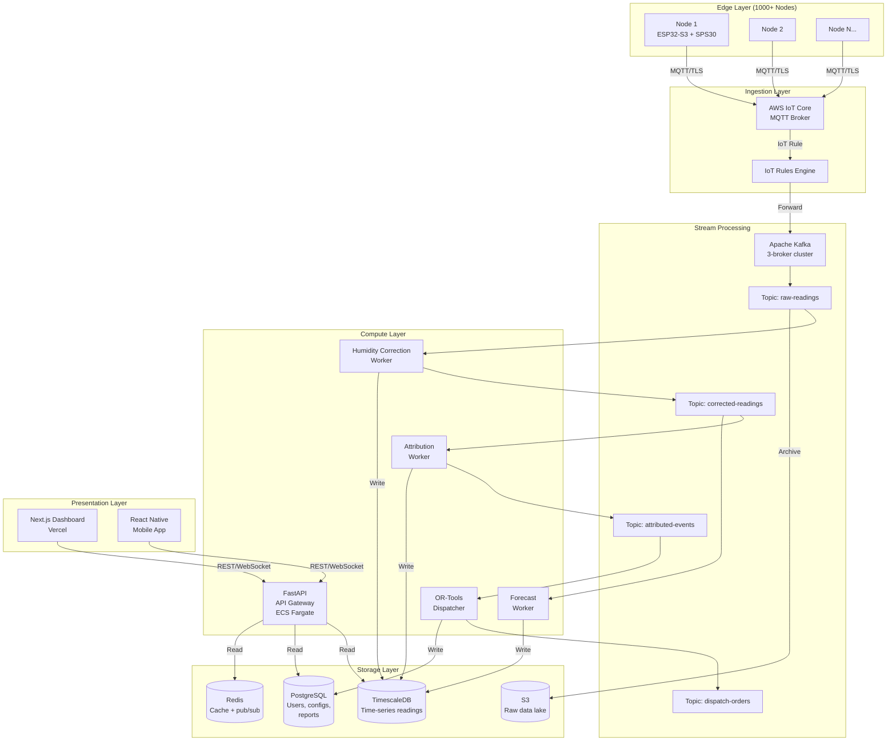

# VayuBudhi 2.0: Enterprise Production Plan

> [!CAUTION]
> This document is written with zero sentimentality. Every section begins with a **brutal audit** of what currently exists, why it will fail in production, and what the enterprise-grade replacement must be. The goal is a product that a municipal government would sign a 5-year contract for.

---

## Table of Contents
1. [Phase 1: Hardware Redesign](#phase-1-hardware-redesign)
2. [Phase 2: Sensor Calibration & ML Pipeline](#phase-2-sensor-calibration--ml-pipeline)
3. [Phase 3: Cloud Infrastructure & Data Platform](#phase-3-cloud-infrastructure--data-platform)
4. [Phase 4: Government Integration & Compliance](#phase-4-government-integration--compliance)
5. [Phase 5: Business Model & Go-to-Market](#phase-5-business-model--go-to-market)

---

## Phase 1: Hardware Redesign

### Current State Audit

| Component | Current | Fatal Flaw |
|---|---|---|
| **PM Sensor** | SDS011 (~$18) | Mechanical fan dies after ~8,000 hrs (<1 year). No humidity compensation. Hygroscopic growth of aerosols at RH >75% inflates PM2.5 readings by 30–200%. Not certified for regulatory use anywhere. |
| **MCU** | ESP32 Dev Board (~$8) | The CP2102 USB-UART bridge + AMS1117 voltage regulator draw ~45mA even during deep sleep. Solar autonomy is impossible. No hardware crypto for secure MQTT/TLS. |
| **Weather** | BME280 (~$3) | Adequate for temperature/humidity/pressure. However, it is mounted on the same breadboard as the hot ESP32, causing a +3–5°C thermal bias on temperature readings. |
| **Connectivity** | WiFi (802.11 b/g/n) | Requires a local access point. Useless on lampposts, rooftops, or any outdoor municipal deployment. No fallback if the AP goes down. |
| **Display** | 16×2 LCD I2C | Useful only for demos. An enterprise node is unmanned—nobody is reading an LCD on a lamppost. Wastes power. |
| **Power** | USB cable from laptop/wall | Zero autonomy. A single power outage kills the node. |
| **Enclosure** | None (bare breadboard) | Will be destroyed by the first rain, dust storm, or bird. |
| **Wiring** | Breadboard + jumper wires | Contact resistance causes intermittent I2C failures. Vibration from wind or traffic will disconnect wires within weeks. |

### Enterprise Hardware Bill of Materials (BOM)

| # | Component | Part Number | Unit Cost (USD) | Why This Part |
|---|---|---|---|---|
| 1 | **PM Sensor** | Sensirion SPS30 | $45 | MCERTS-certified. I2C + UART interface. Built-in fan with auto-cleaning cycle (10+ year MTBF). Measures PM1.0/PM2.5/PM4.0/PM10.0 simultaneously. Internal humidity compensation algorithm. |
| 2 | **Gas Sensor (NO₂/O₃)** | Sensirion SGP41 | $8 | Adds VOC and NOx index. Critical for distinguishing vehicular exhaust (high NO₂) from biomass burning (low NO₂, high PM). Without this, source attribution is guesswork. |
| 3 | **MCU** | ESP32-S3-WROOM-1 (bare module) | $4 | AI/TinyML acceleration (vector instructions). Hardware AES-256 + SHA for TLS/MQTT without software overhead. Ultra-low-power coprocessor (ULP) for deep sleep at ~10μA. |
| 4 | **Cellular Module** | SIMCom SIM7000G | $18 | NB-IoT + LTE Cat-M1 + GNSS. Global band support. Ultra-low power (~1mA in PSM). Allows deployment anywhere with cellular coverage. |
| 5 | **Weather Sensor** | BME280 (on external breakout) | $3 | Same sensor, but mounted on a 15cm cable outside the enclosure in a Stevenson-style radiation shield to eliminate thermal bias from the MCU. |
| 6 | **Power Management** | Texas Instruments BQ25185 PMIC | $2 | Single-chip solar MPPT charger + battery gauge + load switch. Handles 18650 Li-ion charging from a 6V/2W solar panel with >95% efficiency. |
| 7 | **Battery** | Samsung INR18650-35E (3500mAh) | $5 | 3.6V, 3500mAh. Provides ~72 hours of autonomy without solar (worst-case monsoon). |
| 8 | **Solar Panel** | 6V/2W monocrystalline | $6 | Enough to sustain indefinite operation in Indian latitude (avg 4.5 peak sun hours). |
| 9 | **Enclosure** | Custom IP67 ABS box + PTFE membrane vent | $12 | Waterproof. The PTFE vent allows airflow for the SPS30 while blocking liquid water. UV-stabilized ABS. |
| 10 | **PCB** | Custom 4-layer PCB (JLCPCB) | $2 (at 100 qty) | Eliminates all jumper wires. Proper impedance-matched antenna traces for cellular. Ground planes for noise isolation between analog sensors and digital MCU. |
| | **SIM Card** | IoT eSIM (e.g., Hologram.io) | $0.40/month | Global roaming. Pay-per-byte pricing (~$0.40/mo at our data rates). |
| | **TOTAL PER NODE** | | **~$105** | |

### Custom PCB Design Specifications

```
Board: 4-layer, 80mm × 60mm, FR4 1.6mm
Layer Stack:
  L1: Signal + Component placement
  L2: Ground plane (unbroken, for EMI shielding)
  L3: Power plane (3.3V rail)
  L4: Signal + Antenna

Key Design Rules:
  - SPS30 connector: 5-pin ZH 1.5mm JST (I2C mode: SDA/SCL/VCC/GND + SEL tied to GND)
  - SIM7000G: 50Ω impedance-matched U.FL antenna connector, separate LDO (3.8V for GSM bursts)
  - BME280: External via 4-pin JST cable (15cm), NOT on-board
  - ESP32-S3: Integrated PCB antenna (2.4GHz), keep-out zone per Espressif guidelines
  - PMIC: BQ25185 with MPPT divider set for 6V panel Voc
  - Battery: Spring-loaded 18650 holder on bottom side
  - Programming: Tag-Connect TC2030 (no USB connector in production—saves power and board space)
  - Debug LED: Single RGB LED (NeoPixel) for field diagnostics, software-disableable
```

### Firmware Architecture (Rewrite)

The current firmware is a single monolithic `loop()` function. Enterprise firmware must be:

```
Current: Single loop() → read sensor → build JSON string → HTTP POST → repeat

Enterprise:
  ├── FreeRTOS Task 1: Sensor Acquisition (priority 3)
  │   ├── Read SPS30 via I2C every 30 seconds
  │   ├── Read SGP41 via I2C every 10 seconds (VOC needs frequent sampling)
  │   ├── Read BME280 every 60 seconds
  │   └── Push readings to a FreeRTOS Queue
  │
  ├── FreeRTOS Task 2: Edge Processing (priority 2)
  │   ├── Consume from Queue
  │   ├── Apply κ-Köhler humidity correction on-device
  │   ├── Calculate PM2.5/PM10 ratio for source fingerprinting
  │   ├── Run TinyML anomaly detection (optional, ESP32-S3 vector unit)
  │   └── Push processed payload to Transmit Queue
  │
  ├── FreeRTOS Task 3: Telemetry (priority 1)
  │   ├── Consume from Transmit Queue
  │   ├── Connect to AWS IoT Core via MQTT over TLS 1.2 (using SIM7000G)
  │   ├── Publish to topic: vayubudhi/{node_id}/telemetry
  │   ├── Subscribe to topic: vayubudhi/{node_id}/commands (for OTA updates, config changes)
  │   └── If publish fails, store in SPIFFS flash queue (up to 1000 readings)
  │
  └── FreeRTOS Task 4: Power Manager (priority 4)
      ├── Monitor battery voltage via ADC
      ├── If V_bat < 3.2V → enter deep sleep, wake on RTC timer every 5 minutes
      ├── If V_bat > 3.8V → normal operation (30-second intervals)
      └── Report power telemetry in every payload
```

### Weatherproofing & Mounting

```
Enclosure Assembly:
  ┌─────────────────────────────────┐
  │  Solar Panel (top, angled 15°)  │
  ├─────────────────────────────────┤
  │  ┌───────────────────────────┐  │
  │  │   Custom PCB + 18650      │  │  ← IP67 ABS Box
  │  │   (sealed compartment)    │  │
  │  └───────────────────────────┘  │
  │  ┌──────┐    ┌──────────────┐   │
  │  │ PTFE │    │  Stevenson   │   │
  │  │ Vent │    │  Shield      │   │  ← External sensors
  │  │(SPS30│    │  (BME280)    │   │
  │  │inlet)│    │              │   │
  │  └──────┘    └──────────────┘   │
  └─────────────────────────────────┘
          │
    Stainless steel
    hose clamp mount
    (for lamppost/pole)
```

### Phase 1 Risks & Mitigations

| Risk | Probability | Impact | Mitigation |
|---|---|---|---|
| SIM7000G has high power draw during GSM registration | Medium | Battery drain | Use PSM (Power Saving Mode) + eDRX. Only wake radio for MQTT publish every 60s. |
| SPS30 fan clogged in high-dust environments | Low | Sensor failure | SPS30 has built-in auto-clean. Additionally, schedule a forced fan-clean cycle every 168 hours via firmware. |
| Solar panel insufficient during monsoon (July–Sept) | High | Node goes offline | 3500mAh battery provides 72-hour buffer. Firmware enters low-power mode (5-min intervals instead of 30s). |
| PCB antenna detuning inside ABS enclosure | Medium | Poor cellular signal | Simulate antenna performance in enclosure with OpenEMS before manufacturing. Add U.FL connector as fallback for external antenna. |

---

## Phase 2: Sensor Calibration & ML Pipeline

### Current State Audit

| Component | Current | Fatal Flaw |
|---|---|---|
| **Humidity Correction** | None | The SDS011 (and even the SPS30) uses laser light scattering. At RH >75%, water condenses on aerosol particles (hygroscopic growth), inflating their apparent diameter. Your PM2.5 readings during fog or monsoon are **meaningless** without correction. |
| **Source Attribution** | Random Forest with weak heuristic labels | The classifier is trained on *self-generated noisy labels* from `apply_weak_heuristics()`. This is circular—the model learns your heuristics, not ground truth. It has never seen a real labeled pollution event. |
| **Conformal Prediction** | MAPIE wrapper, but `ml_service.py` uses a *mock* conformal set (line 98–99: `probs[i] > 0.1`) | The backend doesn't actually call MAPIE's `predict()`. It constructs a fake prediction set by thresholding raw probabilities at 10%. This is **not** conformal prediction—it provides zero statistical guarantees. |
| **Forecasting** | XGBoost 24h forecast | Trained on limited API data. No spatial features (wind direction, nearby sources). No temporal features (hour of day, day of week, season). |
| **Training Data** | ~700 rows from `dataset.csv` | Far too little for production ML. Need 50,000+ labeled readings across seasons, geographies, and weather conditions. |
| **Model Serving** | `joblib.load()` at startup, synchronous inference in the API request path | A single slow prediction blocks the entire API. No model versioning. No A/B testing. No rollback capability. |

### Enterprise ML Architecture

#### 2.1 Humidity Correction Model

The κ-Köhler correction must happen at **two levels**:

**On-device (Edge):** A lightweight linear correction applied in firmware before transmission:
```
PM2.5_corrected = PM2.5_raw / (1 + κ * (RH / (100 - RH)))

Where:
  κ = 0.4 (ammonium sulfate, typical urban aerosol)
  RH = relative humidity from BME280

This is a first-order approximation. Cheap but effective for RH < 85%.
```

**In-cloud (Backend):** A neural network trained on co-located reference data:
```
Input features:  [PM2.5_raw, PM10_raw, RH, Temperature, Pressure, Dew_Point, Hour_of_Day]
Target:          PM2.5_reference (from co-located CAAQMS station)
Architecture:    3-layer MLP (64→32→1) with dropout
Training data:   30+ days of co-located readings (our node next to a government station)
```

#### 2.2 Source Attribution Overhaul

**Problem:** The current classifier trains on self-generated labels. This is scientifically invalid.

**Solution:** Multi-signal source fingerprinting using physics-informed features:

| Feature | Source: Vehicular | Source: Industrial | Source: Biomass | Source: Construction |
|---|---|---|---|---|
| PM2.5/PM10 ratio | 0.5–0.7 | 0.3–0.5 | 0.7–0.9 | 0.1–0.3 |
| NO₂ (from SGP41) | High | Medium | Low | Very Low |
| VOC Index (SGP41) | Medium | High | High | Low |
| Hour of day | Rush hours (8–10, 17–19) | Consistent | Night/early morning | Daytime |
| Wind direction | Correlates with roads | Correlates with industrial zone | Random | Correlates with construction site |

**Training Data Strategy:**
1. **Phase A (Immediate):** Use the Indian government's CPCB open data API (real-time AQI from 400+ CAAQMS stations across India) combined with meteorological data from Open-Meteo API. Label using expert heuristic rules validated against published receptor modeling studies.
2. **Phase B (3-month):** Deploy 5 nodes co-located with CAAQMS stations. Collect 90 days of paired data. Train a supervised model on real ground truth.
3. **Phase C (6-month):** Partner with an atmospheric science lab (IIT Delhi, IIT Kanpur, or NEERI) for Positive Matrix Factorization (PMF) validated labels.

#### 2.3 Fix the Conformal Prediction Pipeline

**The current `ml_service.py` is lying.** Line 98–99 constructs a fake prediction set:
```python
# Current (FAKE conformal):
prediction_set = [str(classes[i]) for i in range(len(classes)) if probs[i] > 0.1]
```

**The fix:** Use MAPIE's `MapieClassifier` properly end-to-end:
```python
# Enterprise (REAL conformal):
from mapie.classification import MapieClassifier

# During training:
mapie_clf = MapieClassifier(estimator=rf_model, method="lac", cv="prefit")
mapie_clf.fit(X_calib, y_calib)

# During inference:
y_pred, y_pis = mapie_clf.predict(X_new, alpha=0.10)
# y_pis is a boolean mask: shape (n_samples, n_classes, 1)
# prediction_set = classes where y_pis is True
```
This provides a **mathematically guaranteed** 90% coverage rate. If the prediction set contains more than 2 classes, it means the model is genuinely uncertain—route a verification drone instead of an enforcement van.

#### 2.4 Model Serving Architecture

```
Current:  FastAPI → joblib.load() → synchronous predict() → response

Enterprise:
  FastAPI (API Gateway)
    │
    ├── POST /ingest → Kafka Topic: "raw-readings"
    │
    │   Consumer Group 1: Humidity Correction Worker
    │   ├── Reads from "raw-readings"
    │   ├── Applies κ-Köhler + MLP correction
    │   └── Writes to Kafka Topic: "corrected-readings"
    │
    │   Consumer Group 2: Attribution Worker
    │   ├── Reads from "corrected-readings"
    │   ├── Runs MapieClassifier.predict()
    │   └── Writes to Kafka Topic: "attributed-events"
    │
    │   Consumer Group 3: Forecasting Worker
    │   ├── Reads from "corrected-readings"
    │   ├── Runs XGBoost + MAPIE regression
    │   └── Writes to Kafka Topic: "forecasts"
    │
    │   Consumer Group 4: Enforcement Trigger
    │   ├── Reads from "attributed-events"
    │   ├── If prediction_set size == 1 AND confidence > 0.90 → trigger OR-Tools routing
    │   └── Writes to Kafka Topic: "dispatch-orders"
    │
    └── Model Registry (MLflow)
        ├── Version control for every model artifact
        ├── A/B testing: route 10% of traffic to candidate model
        └── One-click rollback if new model degrades coverage
```

### Phase 2 Risks & Mitigations

| Risk | Probability | Impact | Mitigation |
|---|---|---|---|
| κ value varies by aerosol composition (urban vs rural) | High | Systematic bias | Use a learned κ (the MLP cloud correction) rather than a fixed constant. The on-device correction is just a first pass. |
| Conformal prediction sets are too large (low model confidence) | Medium | Too many drones dispatched, high cost | This is actually the system working correctly. Large sets = genuine uncertainty. Retrain with more data to shrink sets over time. |
| CPCB API rate limits or downtime | High | Training data pipeline breaks | Cache all API responses. Build a resilient scraper with exponential backoff. Store raw data in S3. |

---

## Phase 3: Cloud Infrastructure & Data Platform

### Current State Audit

| Component | Current | Fatal Flaw |
|---|---|---|
| **Database** | SQLite file (`vayubudhi.db`, 78KB) | Single-writer. Will corrupt under concurrent writes from multiple IoT nodes. Cannot handle time-series queries (e.g., "average PM2.5 in zone 3 over the last 7 days") without full table scans. |
| **API** | Single FastAPI process, `allow_origins=["*"]` | No authentication. No rate limiting. Anyone can POST fake sensor data. No horizontal scaling. |
| **Data ingestion** | HTTP POST to `/api/ingest` | HTTP is too heavy for IoT. Each request has ~500 bytes of header overhead for ~200 bytes of payload. No QoS guarantees. No offline buffering. |
| **Deployment** | `uvicorn` on localhost | Not deployed anywhere. No CI/CD. No monitoring. No alerting. |
| **Security** | None | WiFi credentials are hardcoded in firmware. Backend accepts unauthenticated requests. CORS is `*`. No TLS. |

### Enterprise Cloud Architecture



### Detailed Component Specifications

#### 3.1 MQTT & Device Authentication
```
Protocol:     MQTT v3.1.1 over TLS 1.2
Broker:       AWS IoT Core (serverless, auto-scales)
Auth:         X.509 client certificates (one per device, provisioned during manufacturing)
Topics:
  Publish:    vayubudhi/{node_id}/telemetry     (QoS 1 - at least once)
  Subscribe:  vayubudhi/{node_id}/commands       (QoS 1)
  Subscribe:  vayubudhi/broadcast/ota            (QoS 0 - best effort)

Payload format (Protobuf, NOT JSON — saves 60% bandwidth):
  message SensorPayload {
    string node_id = 1;
    uint64 timestamp_ms = 2;
    float pm1_0 = 3;
    float pm2_5 = 4;
    float pm4_0 = 5;
    float pm10_0 = 6;
    float temperature = 7;
    float humidity = 8;
    float pressure = 9;
    float voc_index = 10;
    float nox_index = 11;
    float battery_voltage = 12;
    float latitude = 13;
    float longitude = 14;
  }
```

#### 3.2 Database Design

**Replace SQLite with a dual-database architecture:**

| Database | Engine | Purpose | Why |
|---|---|---|---|
| **Time-series store** | TimescaleDB (PostgreSQL extension) | All sensor readings | Hypertables with automatic partitioning by time. Continuous aggregates for pre-computed hourly/daily rollups. Native compression (90% storage reduction on data >7 days old). |
| **Relational store** | PostgreSQL 16 | Users, orgs, nodes, configs, reports, audit logs | ACID transactions for business logic. Row-level security for multi-tenant access. |
| **Cache** | Redis 7 | Latest reading per node, session tokens, rate limiting | Sub-millisecond reads for dashboard real-time updates. |
| **Data Lake** | AWS S3 | Raw archived payloads, ML training datasets | Cheap ($0.023/GB/month). Queryable via Athena for ad-hoc analytics. |

#### 3.3 API Redesign

```
Current endpoints (hackathon):
  GET  /                        → Welcome message
  POST /api/ingest              → Accept sensor reading (no auth)
  GET  /api/readings            → List readings (no pagination)

Enterprise endpoints:
  Authentication:
    POST /api/v1/auth/login     → JWT token (for dashboard users)
    POST /api/v1/auth/refresh   → Refresh token

  Device Management:
    POST /api/v1/devices        → Register new node (admin only)
    GET  /api/v1/devices        → List all nodes + last heartbeat
    GET  /api/v1/devices/{id}   → Node detail + health status

  Data:
    GET  /api/v1/readings?node_id=&start=&end=&resolution=  → Paginated time-series query
    GET  /api/v1/readings/latest                              → Latest reading per node (from Redis)
    GET  /api/v1/readings/aggregate?zone=&period=             → Pre-computed aggregates

  Intelligence:
    GET  /api/v1/attribution/{reading_id}     → Conformal prediction set for a reading
    GET  /api/v1/forecast?node_id=&horizon=   → PM2.5 forecast with confidence intervals
    GET  /api/v1/hotspots?threshold=           → Current active hotspots

  Enforcement:
    POST /api/v1/dispatch/optimize             → Trigger OR-Tools route optimization
    GET  /api/v1/dispatch/routes               → Active routes
    GET  /api/v1/dispatch/routes/{id}          → Route detail + stops

  Reports:
    GET  /api/v1/reports/violation/{event_id}  → Auto-generated legal violation report (PDF)
    GET  /api/v1/reports/monthly?zone=         → Monthly compliance summary

  Admin:
    POST /api/v1/admin/ota                     → Push firmware update to nodes
    GET  /api/v1/admin/system/health           → Infrastructure health dashboard
```

#### 3.4 Security Hardening

| Layer | Current | Enterprise |
|---|---|---|
| Device ↔ Cloud | HTTP, no auth, hardcoded WiFi creds | MQTT over TLS 1.2, X.509 per-device certificates, credentials stored in ESP32 eFuse (read-once, hardware protected) |
| API Auth | None (`allow_origins=["*"]`) | JWT (RS256) with role-based access control (RBAC): `admin`, `officer`, `viewer`, `device` |
| Data at rest | SQLite file, unencrypted | PostgreSQL with TDE (Transparent Data Encryption). S3 with SSE-KMS. |
| Secrets | Hardcoded in source code | AWS Secrets Manager. Zero secrets in git. |
| Rate limiting | None | Redis-backed sliding window: 100 req/min per user, 10,000 req/min per device |

### Phase 3 Cost Estimate (Monthly, at 1000 nodes)

| Service | Specification | Monthly Cost |
|---|---|---|
| AWS IoT Core | 1000 devices × 1440 msgs/day × 30 days = 43.2M msgs | ~$45 |
| Kafka (MSK) | 3-broker `kafka.t3.small` | ~$200 |
| TimescaleDB | `db.r6g.large` (managed, 500GB) | ~$250 |
| PostgreSQL RDS | `db.t4g.medium` | ~$70 |
| Redis ElastiCache | `cache.t4g.micro` | ~$15 |
| ECS Fargate (API + Workers) | 4 tasks × 0.5 vCPU × 1GB | ~$60 |
| S3 (data lake) | ~50GB/month | ~$1 |
| **TOTAL** | | **~$641/month** |

---

## Phase 4: Government Integration & Compliance

### Current State Audit

| Component | Current | Fatal Flaw |
|---|---|---|
| **Dashboard** | Next.js "War Room" with hardcoded demo data | No authentication. No multi-tenancy. A city officer cannot log in and see only their jurisdiction. |
| **Legal output** | None | The system generates OR-Tools routes but produces no legally admissible documentation. An inspector cannot hand a judge a "VayuBudhi said so" printout. |
| **Regulatory compliance** | None | India's CPCB requires air quality monitors to meet IS 5182 standards. EU requires EN 12341. Without certification, our data has zero legal weight. |
| **Data sovereignty** | US-based cloud (if deployed on AWS us-east-1) | Indian government data must stay in India (per MeitY guidelines). Must use AWS Mumbai (ap-south-1) or Azure Central India. |

### Enterprise Integration Plan

#### 4.1 Multi-Tenant SaaS Dashboard

```
Role-Based Views:
  ├── Super Admin (VayuBudhi team)
  │   ├── All cities, all nodes, all data
  │   ├── System health, billing, OTA management
  │   └── ML model performance monitoring (MLflow dashboard embed)
  │
  ├── City Administrator
  │   ├── Sees only their city's nodes and data
  │   ├── Configure alert thresholds per zone
  │   ├── Approve/reject automated dispatch recommendations
  │   └── Download monthly compliance reports (PDF)
  │
  ├── Field Officer
  │   ├── Mobile-first view (React Native app)
  │   ├── Receives push notifications for dispatches
  │   ├── GPS-guided navigation to hotspot
  │   ├── Upload photo evidence from field
  │   └── Mark violation as "confirmed" or "false positive" (feeds back into ML training)
  │
  └── Public Citizen
      ├── Read-only AQI map for their city
      ├── Subscribe to air quality alerts for their neighborhood
      └── File pollution complaints (routed to nearest node for verification)
```

#### 4.2 Automated Legal Violation Reports

When the system detects a high-confidence violation (conformal set size = 1, confidence ≥ 90%), it auto-generates a PDF containing:

```
VayuBudhi Automated Violation Report
═══════════════════════════════════════
Report ID:        VB-2026-MUM-00347
Generated:        2026-08-15T14:32:00 IST
Status:           AUTO-GENERATED (Pending Officer Verification)

SECTION 1: EVENT SUMMARY
  Node ID:        VB-MUM-042
  Location:       19.0760°N, 72.8777°E (Andheri West, Mumbai)
  Detection Time: 2026-08-15T14:28:12 IST
  PM2.5 Reading:  287 μg/m³ (SEVERE — 11.5× WHO guideline)
  PM10 Reading:   412 μg/m³

SECTION 2: SOURCE ATTRIBUTION (AI)
  Model:          Random Forest + MAPIE Conformal Prediction v2.3.1
  Prediction Set: ["Open Waste Burning"]
  Set Size:       1 (HIGH CONFIDENCE)
  Coverage:       90% (α = 0.10)
  Probabilities:  Open Waste Burning: 0.87, Industrial: 0.08, Other: 0.05

SECTION 3: ENVIRONMENTAL CONDITIONS
  Temperature:    33.2°C
  Humidity:       72% (Humidity correction applied: κ-Köhler + MLP v1.2)
  Wind Speed:     4.2 m/s from SW
  Ventilation:    Low (BLH × WS = 1,680 m²/s, threshold: 3,000)

SECTION 4: SENSOR CALIBRATION STATUS
  Last calibrated against reference: 2026-08-01 (14 days ago)
  Calibration R²: 0.94
  Sensor health:  GOOD (SPS30 auto-clean last run: 12 hours ago)

SECTION 5: APPLICABLE REGULATIONS
  - Air (Prevention and Control of Pollution) Act, 1981 — Section 21
  - CPCB National Ambient Air Quality Standards (2009)
  - Municipal Solid Waste Management Rules, 2016 — Rule 15(1)

SECTION 6: RECOMMENDED ACTION
  Dispatch Type:  Enforcement Van
  Optimal Route:  [Generated by OR-Tools, see attached map]
  ETA:            18 minutes
```

#### 4.3 Regulatory Certification Path

| Certification | Jurisdiction | What It Proves | Timeline | Cost |
|---|---|---|---|---|
| **CPCB Type Approval** | India | Data can be used for regulatory monitoring | 6–12 months co-location study | ~$5,000 (lab fees) |
| **MCERTS** | UK/EU | Sensor meets EN 12341 equivalence | 3–6 months | ~$15,000 |
| **US EPA Performance Targets** | USA | Meets EPA PM2.5 sensor targets (slope 0.65–1.35, R² > 0.70) | 6 months field evaluation | ~$10,000 |

> [!WARNING]
> Without at least one of these certifications, our data has **zero legal standing**. A city government cannot issue fines based on uncertified sensor data. This is the single biggest barrier to revenue.

---

## Phase 5: Business Model & Go-to-Market

### Revenue Model

| Revenue Stream | Description | Pricing |
|---|---|---|
| **Hardware Sales** | Sell VayuBudhi V2 nodes to municipalities | $150/node (43% gross margin on $105 BOM) |
| **SaaS Subscription** | Cloud platform, dashboard, ML pipeline, reports | $2/node/month (billed annually) |
| **Data Licensing** | Sell anonymized, hyper-local air quality data to insurance companies, real estate platforms, urban planners | $500–$5,000/month per data consumer |
| **Consulting** | Custom deployment, integration with existing SCADA/smart city platforms | $150/hour |

### Unit Economics (at 1,000 nodes deployed)

| Metric | Value |
|---|---|
| Hardware Revenue (one-time) | $150,000 |
| Monthly Recurring Revenue (SaaS) | $2,000/month = $24,000/year |
| Monthly Infrastructure Cost | ~$641/month = ~$7,700/year |
| Monthly SIM Cost | $400/month = $4,800/year |
| **Annual Gross Profit (SaaS only)** | **$11,500/year** |
| **Break-even (hardware + SaaS)** | **~14 months** |

> [!IMPORTANT]
> The real money is in **data licensing** and **scale**. At 10,000 nodes across 5 cities, the SaaS alone generates $240,000/year with marginal infrastructure cost increase. Data licensing can 10× that.

### Go-to-Market Phased Strategy

| Phase | Timeline | Goal |
|---|---|---|
| **Pilot** | Months 1–6 | Deploy 50 nodes in one city. Co-locate 5 nodes with CAAQMS for certification. Prove accuracy. Get one municipal MoU signed. |
| **Seed** | Months 7–12 | Raise seed funding ($200K–$500K). Scale to 500 nodes across 2 cities. Begin CPCB certification process. |
| **Growth** | Months 13–24 | 5,000 nodes across 5 cities. First data licensing deals. Hire a 5-person team. |
| **Enterprise** | Months 24+ | International expansion (Southeast Asia, Africa — same pollution crisis, same infrastructure gaps). White-label the platform for smart city integrators. |

---

## Verification Plan (Across All Phases)

| Test | Method | Success Criteria |
|---|---|---|
| **Hardware Endurance** | Deploy 3 V2 nodes outdoors for 90 days through monsoon season. Monitor uptime, battery, data quality remotely. | >95% uptime. <5% data loss. Battery never drops below 3.0V. |
| **Accuracy Benchmark** | Co-locate V2 node with CAAQMS station for 30 days. Compare hourly averages. | R² > 0.85, slope between 0.80–1.20, bias < ±5 μg/m³ |
| **Conformal Coverage** | Run 10,000 test predictions. Count how often the true label falls inside the prediction set. | Coverage ≥ 88% (target 90%, allow 2% tolerance) |
| **Cloud Load Test** | Simulate 5,000 virtual nodes sending payloads every 30 seconds for 24 hours. | API p99 latency < 500ms. Zero message loss in Kafka. TimescaleDB write throughput > 10,000 inserts/sec. |
| **Security Audit** | Hire a third-party penetration testing firm. | Zero critical/high vulnerabilities. All OWASP Top 10 mitigated. |
| **End-to-End Latency** | Measure time from sensor reading to dispatch order. | < 60 seconds (target: 42 seconds as claimed) |

---

## Open Questions

> [!IMPORTANT]
> **Decisions needed before we write any code:**
> 1. **Which city for the pilot?** We need a city where you have physical access to install nodes AND where there is a CAAQMS station nearby for co-location calibration.
> 2. **Cloud provider:** AWS (ap-south-1 Mumbai) vs Azure (Central India) vs GCP (Mumbai)? AWS IoT Core is the most mature, but Azure has stronger government partnerships in India.
> 3. **PCB manufacturing:** JLCPCB (cheapest, 7-day turnaround from China) vs PCBWay (slightly more expensive, better for prototypes) vs local Indian manufacturer (longer lead time, but avoids import duties)?
> 4. **Funding:** Are you bootstrapping the pilot ($5,000–$10,000 for 50 nodes + cloud) or seeking external funding immediately?
> 5. **Team:** Which phases can you personally execute vs. which require hiring? PCB design (KiCad) and firmware (FreeRTOS) are specialized skills.
